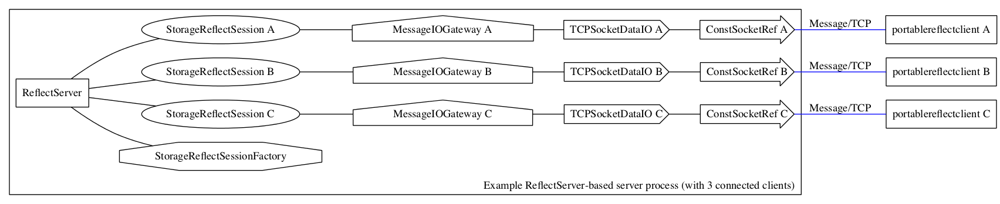

# muscle::ReflectServer class [(API)](https://public.msli.com/lcs/muscle/html/classmuscle_1_1ReflectServer.html)

```#include "reflector/ReflectServer.h"```

[](muscled_sessions.png)

[ReflectServer](https://public.msli.com/lcs/muscle/html/classmuscle_1_1ReflectServer.html) implements a general-purpose event-loop for all the other MUSCLE components to live in.

* Similar to: [QApplication](http://doc.qt.io/qt-5/qapplication.html), [QEventLoop](http://doc.qt.io/qt-5/qeventloop.html), [ACE::Reactor](http://www.dre.vanderbilt.edu/Doxygen/5.6/html/ace/classACE__Reactor.html)
* A typical MUSCLE server program would put a [ReflectServer](https://public.msli.com/lcs/muscle/html/classmuscle_1_1ReflectServer.html) object on the stack in main(), add one or more [ServerComponent](https://public.msli.com/lcs/muscle/html/classmuscle_1_1ServerComponent.html) objects to it, then call [ServerProcessLoop()](https://public.msli.com/lcs/muscle/html/classmuscle_1_1ReflectServer.html#a76a1b18af0dacbb6b0a03d5c6433e15e) on the [ReflectServer](https://public.msli.com/lcs/muscle/html/classmuscle_1_1ReflectServer.html).
* [ServerProcessLoop()](https://public.msli.com/lcs/muscle/html/classmuscle_1_1ReflectServer.html#a76a1b18af0dacbb6b0a03d5c6433e15e) will typically not return until it is time for the program to exit.
* [ServerProcessLoop()](https://public.msli.com/lcs/muscle/html/classmuscle_1_1ReflectServer.html#a76a1b18af0dacbb6b0a03d5c6433e15e) uses a [SocketMultiplexer](https://public.msli.com/lcs/muscle/html/classmuscle_1_1SocketMultiplexer.html) internally to handle I/O operations and calls callback methods on the attached [ServerComponent](https://public.msli.com/lcs/muscle/html/classmuscle_1_1ServerComponent.html) objects at the appropriate times.
* The [ReflectServer](https://public.msli.com/lcs/muscle/html/classmuscle_1_1ReflectServer.html) also handles the role of a [PulseNodeManager](https://public.msli.com/lcs/muscle/html/classmuscle_1_1PulseNodeManager.html), with [ServerProcessLoop()](https://public.msli.com/lcs/muscle/html/classmuscle_1_1ReflectServer.html#a76a1b18af0dacbb6b0a03d5c6433e15e) calling [Pulse()](https://public.msli.com/lcs/muscle/html/classmuscle_1_1PulseNode.html#ac530185533f417b7c6c86032c82b6a0d) on its attached objects at the time(s) they have requested to have their [Pulse()](https://public.msli.com/lcs/muscle/html/classmuscle_1_1PulseNode.html#ac530185533f417b7c6c86032c82b6a0d) method called.
* [ServerComponent](https://public.msli.com/lcs/muscle/html/classmuscle_1_1ServerComponent.html) object subclasses include [ReflectSessionFactory](https://public.msli.com/lcs/muscle/html/classmuscle_1_1ReflectSessionFactory.html) objects (for accepting incoming TCP connections) and [AbstractReflectSession](https://public.msli.com/lcs/muscle/html/classmuscle_1_1AbstractReflectSession.html) objects (for handling the I/O and state associated with a single file descriptor or socket)
* More complex MUSCLE programs might have multiple threads, many with a separate [ReflectServer](https://public.msli.com/lcs/muscle/html/classmuscle_1_1ReflectServer.html) object for each thread's event-loop.  The [MessageTransceiverThread](https://public.msli.com/lcs/muscle/html/classmuscle_1_1MessageTransceiverThread.html) class, in particular, does this.  A thread's [ReflectServer::ServerProcessLoop()](https://public.msli.com/lcs/muscle/html/classmuscle_1_1ReflectServer.html#a76a1b18af0dacbb6b0a03d5c6433e15e) call won't return until it is time for the thread to exit.
* New session objects can be added to the [ReflectServer](https://public.msli.com/lcs/muscle/html/classmuscle_1_1ReflectServer.html) by calling [AddNewSession()](https://public.msli.com/lcs/muscle/html/classmuscle_1_1ReflectServer.html#a2dde8023e9bf63a5bbc8965dd46d400b) (either on the [ReflectServer](https://public.msli.com/lcs/muscle/html/classmuscle_1_1ReflectServer.html) or on an already-attached session-object).
* New session objects that want to represent an outgoing TCP connection can be added to the [ReflectServer](https://public.msli.com/lcs/muscle/html/classmuscle_1_1ReflectServer.html) by calling [AddNewConnectSession()](https://public.msli.com/lcs/muscle/html/classmuscle_1_1ReflectServer.html#acab73ff35870966485812e827b10bcb4).  The TCP connect will be done asynchronously (using a non-blocking connect) so it won't hold off the event loop.
* New [ReflectSessionFactory](https://public.msli.com/lcs/muscle/html/classmuscle_1_1ReflectSessionFactory.html) objects can be added to the server by calling [PutAcceptFactory()](https://public.msli.com/lcs/muscle/html/classmuscle_1_1ReflectServer.html#a3fa12e8adbe05dbd25ca43e22d93e38b).

Try compiling and running the mini-example-programs in `muscle/html/muscle-by-example/examples/reflector` (enter `make` to compile example_*, and then run each from Terminal while looking at the corresponding .cpp file)

Quick links to source code of relevant MUSCLE-by-example programs:

* [reflector/example_1_dumb_server.cpp](https://public.msli.com/lcs/muscle/muscle/html/muscle-by-example/examples/reflector/example_1_dumb_server.cpp)
* [reflector/example_2_dumb_client.cpp](https://public.msli.com/lcs/muscle/muscle/html/muscle-by-example/examples/reflector/example_2_dumb_client.cpp)
* [reflector/example_3_annotated_dumb_server.cpp](https://public.msli.com/lcs/muscle/muscle/html/muscle-by-example/examples/reflector/example_3_annotated_dumb_server.cpp)
* [reflector/example_4_smart_server.cpp](https://public.msli.com/lcs/muscle/muscle/html/muscle-by-example/examples/reflector/example_4_smart_server.cpp)
* [reflector/example_5_smart_client.cpp](https://public.msli.com/lcs/muscle/muscle/html/muscle-by-example/examples/reflector/example_5_smart_client.cpp)
* [reflector/example_6_smart_server_with_pulsenode.cpp](https://public.msli.com/lcs/muscle/muscle/html/muscle-by-example/examples/reflector/example_6_smart_server_with_pulsenode.cpp)
* [reflector/example_7_smart_server_with_udp_pingpong.cpp](https://public.msli.com/lcs/muscle/muscle/html/muscle-by-example/examples/reflector/example_7_smart_server_with_udp_pingpong.cpp)
